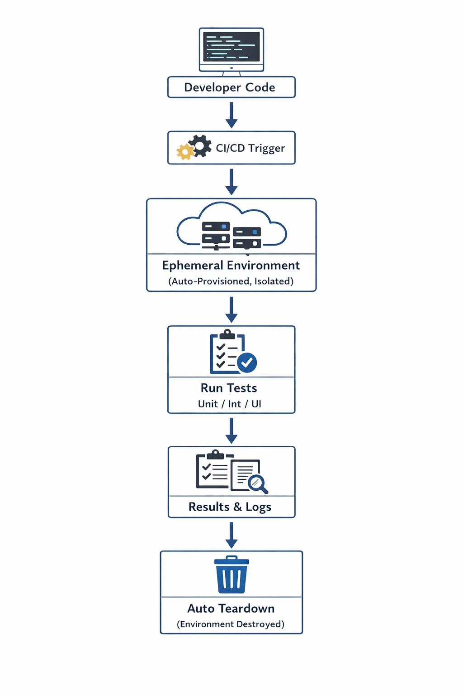
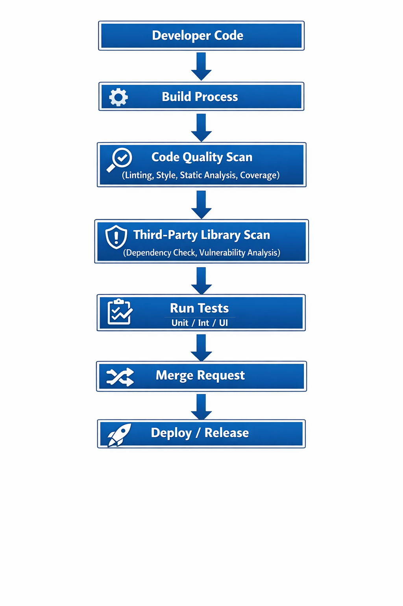

# Testing Proposal

A high level technology agnostic approach on testing using a CI/CD practice aimed at automating and streamlining the software development lifecycle. 

---

## Functional testing approach

### The test pyramid

                   /-------------------\
                  /   End-to-End Test   \
                 /-----------------------\
                /       UI Testing        \
               /---------------------------\
              /       Contract Test         \
             /-------------------------------\
            /      Integration Test           \
           /-----------------------------------\
          /             Unit Test               \
         /---------------------------------------\

The test pyramid is a way of thinking about how different kinds of automated tests should be used to create a balanced portfolio. Its essential point is that you should have many more low-level UnitTests than high level BroadStackTests running through a GUI.

[Martin Fowler](https://martinfowler.com/bliki/TestPyramid.html)

### The shift left paradigm

Shift-left testing[1] is an approach to software testing and system testing in which testing is performed earlier in the lifecycle (i.e. moved left on the project timeline). It is the first half of the maxim "test early and often".

[Wikipedia](https://en.wikipedia.org/wiki/Shift-left_testing)

### Ephemeral testing

Ephemeral testing refers to using short-lived, disposable environments for software testing. These environments are spun up on demand, mimic production systems, and are automatically destroyed after use — making them ideal for rapid, isolated, and cost-efficient testing.

### Functional testing proposal

- Developer Code → pushed to repository.
- Build Process → compiles and packages the application.
- Code Quality Scan → ensures standards, static analysis, and coverage.
- Third-Party Library Scan → checks dependencies for known vulnerabilities (e.g., via tools like OWASP Dependency-Check, Snyk, or Trivy).
- Run Tests → executes unit, integration, contract, UI, and end-to-end tests.
- Review the code by the dev/tester.
- Deploy/Release → only if all checks pass.
This diagram highlights how **security** and **quality gates** are integrated into CI/CD pipelines before deployment.

This automation approach with shift left and micro test planning helps dev, tester, BA and other stakeholders aligned with the business objectives on every phase of the software lifecycle. Making sure that the team can adapt to changes with minimal friction and business . 

 
## Non-Functional testing approach

### Non-Functional testing proposal
